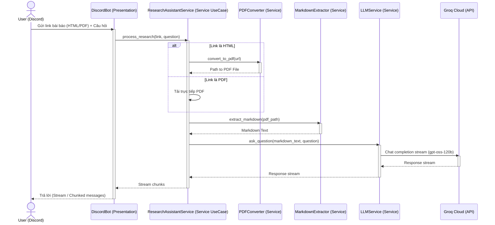

# Tài Liệu Đặc Tả Yêu Cầu & Thiết Kế Kiến Trúc
## Discord Research Assistant Bot (Clean Architecture)

Tài liệu này định nghĩa chi tiết các yêu cầu nghiệp vụ, luồng xử lý và cách tổ chức cấu trúc thư mục dự án tuân thủ theo nguyên lý **Clean Architecture** (dựa trên mẫu thiết kế từ `jujumilk3/fastapi-clean-architecture`), được tối ưu hóa cho ứng dụng Discord Bot quản lý bởi công cụ `uv`.

---

## 1. Tổng Quan Hệ Thống

Hệ thống là một **Discord Bot** hỗ trợ nghiên cứu khoa học. Khi người dùng gửi một liên kết bài báo (dạng HTML hoặc PDF) kèm theo câu hỏi, Bot sẽ tự động tải tài liệu, chuyển đổi sang định dạng Markdown chuẩn, nạp nội dung vào mô hình ngôn ngữ lớn (LLM) thông qua Groq API, và trả về câu trả lời chi tiết cho người dùng dưới dạng streaming.



---

## 2. Đặc Tả Tính Năng (Functional Requirements)

### Tính năng 1: Nhận liên kết và câu hỏi từ Discord
- Người dùng gửi tin nhắn chứa một liên kết bài báo (ví dụ: `https://arxiv.org/html/2605.16120v1` hoặc `https://arxiv.org/pdf/2605.16120v1`) kèm theo nội dung câu hỏi liên quan đến bài báo đó.
- Bot nhận diện URL trong tin nhắn và trích xuất thông tin.

### Tính năng 2: Chuyển đổi và tải xuống tài liệu (Web to PDF)
- Nếu liên kết trỏ thẳng tới file PDF (ví dụ: chứa đuôi `.pdf` hoặc định dạng `/pdf/` của arXiv): Bot tiến hành tải trực tiếp file PDF về thư mục tạm.
- Nếu liên kết là một trang web HTML (ví dụ: trang HTML arXiv, Blog, tin tức): Bot sử dụng một trình duyệt không đầu (Headless Browser - **Playwright**) để render và xuất trang web đó thành một file PDF hoàn chỉnh.

### Tính năng 3: Trích xuất nội dung sang định dạng Markdown
- Sử dụng thư viện **PyMuPDF4LLM** để phân tích file PDF và chuyển đổi nội dung sang định dạng Markdown sạch (Clean Markdown).
- Phương pháp này giúp giữ nguyên cấu trúc bảng biểu, danh sách, và đề mục nhỏ, tối ưu cho ngữ cảnh đầu vào của LLM.

### Tính năng 4: Hỏi đáp qua LLM (Gemini API)
- Gửi câu hỏi của user và nội dung bài báo đã chuyển sang Markdown đến Gemini API thông qua thư viện `google-genai`.
- Sử dụng mô hình chính: `gemini-3.5-flash`, tự động chuyển sang mô hình dự phòng `gemini-3.1-flash-lite` nếu gặp lỗi hết hạn mức (quota limit 429).
- Sử dụng cơ chế Streaming để nhận phản hồi từ LLM và hiển thị mượt mà trên Discord.

---

## 3. Thiết Kế Kiến Trúc (Clean Architecture)

Để đảm bảo dự án dễ bảo trì, dễ kiểm thử (testable) và dễ mở rộng, cấu trúc dự án tuân thủ mô hình **Clean Architecture** với việc phân tách các lớp rõ ràng và sử dụng **Dependency Injection (DI)** thông qua thư viện `dependency-injector`.

### Sơ đồ cấu trúc thư mục dự án

```
discord-research-assistance/
├── .env                         # Lưu trữ token bí mật (DISCORD_BOT_TOKEN, GROQ_API_KEY)
├── pyproject.toml               # File quản lý thư viện chính (quản lý bởi uv)
├── requirement.md               # Tài liệu đặc tả hiện tại
└── app/
    ├── __init__.py
    ├── main.py                  # Điểm khởi động ứng dụng (khởi tạo DI Container & chạy Bot)
    ├── core/
    │   ├── __init__.py
    │   ├── config.py            # Quản lý cấu hình bằng pydantic-settings
    │   ├── container.py         # DI Container khai báo các dependency
    │   └── logger.py            # Cấu hình log tập trung
    ├── domain/
    │   ├── __init__.py
    │   └── interfaces/          # Các interface / class trừu tượng định nghĩa hợp đồng nghiệp vụ
    │       ├── __init__.py
    │       ├── pdf_converter.py
    │       ├── markdown_extractor.py
    │       └── llm_service.py
    ├── services/
    │   ├── __init__.py
    │   ├── pdf_converter.py     # Thực thi convert HTML sang PDF (sử dụng Playwright)
    │   ├── markdown_extractor.py # Thực thi trích xuất Markdown từ PDF (sử dụng PyMuPDF4LLM)
    │   ├── llm_service.py       # Tương tác với Gemini API (tích hợp khả năng tự động chuyển đổi mô hình dự phòng)
    │   └── research_assistant.py # Use case orchestrator điều phối toàn bộ nghiệp vụ chính
    └── presentation/
        ├── __init__.py
        └── discord_bot.py       # Lớp tương tác với Discord API (Discord Bot Client)
```

### Chi tiết các lớp trong kiến trúc

1. **Domain Layer (`app/domain/`)**:
   - Định nghĩa các interface trừu tượng (`Protocols` hoặc `Abstract Base Classes`).
   - Lớp này hoàn toàn cô lập, không phụ thuộc vào bất kỳ thư viện bên ngoài hay framework nào (không phụ thuộc vào Groq, Discord hay Playwright).
   
2. **Service Layer (`app/services/`)**:
   - Chứa logic nghiệp vụ lõi của hệ thống.
   - Các class ở đây sẽ kế thừa và triển khai thực tế các interface đã định nghĩa trong lớp Domain.
   - Ví dụ: `PlaywrightPDFConverter` thực thi interface `PDFConverterInterface`.
   - `ResearchAssistantService` hoạt động như một Use Case điều phối luồng: nhận link -> gọi converter -> gọi extractor -> gửi llm.

3. **Presentation Layer (`app/presentation/`)**:
   - Đóng vai trò là cổng giao tiếp với bên ngoài (ở đây là Discord API).
   - Discord Bot lắng nghe tin nhắn, nhận đầu vào từ người dùng, gọi Use Case từ tầng Service để xử lý và hiển thị kết quả.

4. **Core/Infrastructure Layer (`app/core/`)**:
   - Nơi chứa cấu hình toàn hệ thống (`config.py`) đọc từ file `.env` sử dụng `pydantic-settings`.
   - Chứa `container.py` - nơi khai báo DI Container của thư viện `dependency-injector`, giúp tự động tiêm (inject) các thực thể Service cụ thể vào Discord Bot hoặc các Service khác.

---

## 4. Quản Lý Thư Viện & Cài Đặt (uv)

Dự án sử dụng công cụ quản lý thư viện hiện đại **`uv`** để tối ưu hóa tốc độ và quản lý môi trường ảo.

### Các thư viện cần cài đặt:
- `discord.py`: Giao tiếp với Discord API.
- `google-genai`: Tương tác với Gemini LLM API.
- `pymupdf4llm`: Trích xuất tài liệu PDF sang Markdown.
- `playwright`: Trình duyệt không đầu để chụp và xuất trang web sang PDF.
- `pydantic-settings`: Đọc cấu hình từ file `.env` một cách an sau và tự động ép kiểu.
- `dependency-injector`: Triển khai DI Container chuyên nghiệp cho Clean Architecture.
- `httpx`: Download file PDF trực tiếp một cách bất đồng bộ.

---

## 5. Mẫu Code LLM Gemini API Tham Khảo

Đoạn code dưới đây được sử dụng để tích hợp vào `app/services/llm_service.py`:

```python
from google import genai
from google.genai import types

client = genai.Client()
response = client.models.generate_content_stream(
    model="gemini-3.5-flash",
    contents="Nội dung bài báo (Markdown) kèm câu hỏi...",
    config=types.GenerateContentConfig(
        temperature=0.7,
        system_instruction="You are a professional research assistant",
    )
)

for chunk in response:
    if chunk.text:
        print(chunk.text, end="")
```

---

## 6. Kế Hoạch Triển Khai Từng Bước

1. **Bước 1: Khởi tạo môi trường ảo bằng `uv`** và tạo file cấu hình `pyproject.toml`.
2. **Bước 2: Viết mã nguồn cho lớp Core** bao gồm `config.py` và `logger.py` để đảm bảo hệ thống có thể đọc biến môi trường từ `.env`.
3. **Bước 3: Định nghĩa các Interface** tại `app/domain/interfaces/`.
4. **Bước 4: Viết mã nguồn thực tế cho các Service** tại `app/services/`.
5. **Bước 5: Thiết lập DI Container** tại `app/core/container.py` để liên kết các interface với các class thực thi tương ứng.
6. **Bước 6: Viết Discord Bot** trong lớp `app/presentation/discord_bot.py` để xử lý sự kiện lắng nghe tin nhắn và phản hồi.
7. **Bước 7: Kết nối tất cả trong `app/main.py`** và chạy thử nghiệm.
